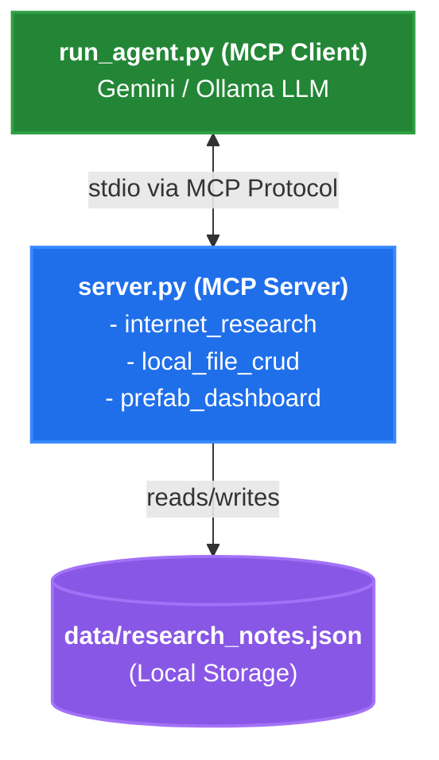

# EAG V3: Session 4 - MCP Assignment

This repository contains my assignment for **Session 4** of the **EAG V3** course.

## Overview

The goal of this project is to build an autonomous research agent utilizing the **Model Context Protocol (MCP)**. The agent orchestrates a complete workflow without human intervention:

1. **Search:** Uses web search tools to gather information based on specific prompts.
2. **Save:** Uses local CRUD tools to save structured metadata into a JSON file.
3. **Render:** Uses an MCP-enabled Prefab UI tool to generate a dynamic, interactive dashboard to visualize the gathered research.

## Architecture



- `assignment_mcp_prefab/server.py`: An MCP server exposing three tools:
  - `internet_research`: Performs Wikipedia and web searches.
  - `local_file_crud`: Handles local JSON data storage.
  - `prefab_research_dashboard`: Renders the final UI using Prefab.
- `assignment_mcp_prefab/run_agent.py`: The MCP client agent loop that connects to the server and uses an LLM (Gemini/Ollama) to autonomously fulfill the research goals.

## How to Run

A helper script is included to clear existing data, run the agent across all 5 test prompts, and launch the Prefab dashboard.

```bash
./run_all.sh
```

Alternatively, you can run the agent manually:
```bash
uv run python assignment_mcp_prefab/run_agent.py
```
