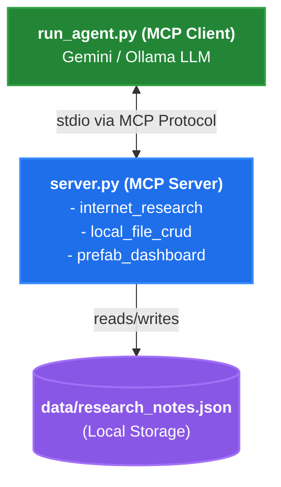

# MCP Architecture Diagram

```mermaid
graph TD
    classDef client fill:#238636,stroke:#2ea043,stroke-width:2px,color:white;
    classDef server fill:#1f6feb,stroke:#388bfd,stroke-width:2px,color:white;
    classDef storage fill:#8957e5,stroke:#a371f7,stroke-width:2px,color:white;
    
    Client["<b>run_agent.py (MCP Client)</b><br/>Gemini / Ollama LLM"]:::client
    Server["<b>server.py (MCP Server)</b><br/>- internet_research<br/>- local_file_crud<br/>- prefab_dashboard"]:::server
    Data[("<b>data/research_notes.json</b><br/>(Local Storage)")]:::storage
    
    Client <-->|stdio via MCP Protocol| Server
    Server -->|reads/writes| Data
```
